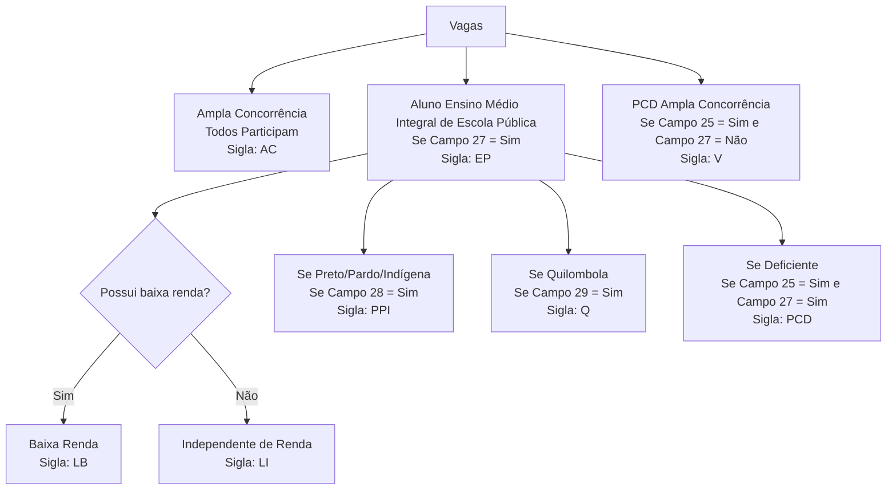

# Levantamento de dados de inscrição

## Etapas comuns nos Processos Seletivos

> **Documento:** Especificação de campos e formulários dos processos seletivos (módulo Seleção — Uni+)
> **Versão:** v2
> **Data:** 2026-06-16
> **Status:** rascunho para revisão
>
> **Fonte da verdade:** as regras de negócio (RN01–RN08) e o vocabulário canônico do projeto Uni+
> (ver `docs/visao-do-projeto.md`) prevalecem sobre qualquer texto herdado de editais ou sistemas legados.
>
> **Rastreabilidade:** cada seção referencia os requisitos funcionais do registro público de requisitos
> do Uni+ pelos identificadores estáveis `UNI-REQ-####`. A consolidação está em
> "Rastreabilidade de requisitos (UNI-REQ)", ao final do documento.
>
> **Notação de condicionais:** `(se campo NN = "valor")` indica exibição/preenchimento condicional.
> Campos marcados como `Campo Calculável` são derivados pelo sistema, não preenchidos pelo candidato.

## Etapas

| # | Etapa | Atividades| 
|---|-------|-----------|
| 1 | Cadastramento do edital: (o sistema deverá permitir o cadastramento de informações gerais para geração do edital) ||
| 2 | Cadastramento do processo no sistema: - CEPS ||
| 3 | Inscrição de Candidatos |<ul><li>```Formulários de Inscrição```</li></ul>|
| 4 | Homologação das inscrições |<ul><li>Análise dos documentos obrigatórios enviados pelos candidatos.</li><li>Marcação de Deferido ou Indeferido, com os motivos do indeferimento, de acordo com os itens específicos do edital (apenas marcar nos itens obrigatórios, indicando a ausência), com campo de observação.</li><li>Geração de relação de candidatos deferidos e outra de indeferidos, com número de inscrição, nome do candidato, status (deferido ou indeferido) e motivo.</li></ul>|
| 5 | Preparação para aplicação das etapas |<ul><li>Ensalamento dos candidatos deferidos.</li><li>Geração de listas de frequência, atas de sala, atas de entrevistas, termo de compromisso…</li><li>Impressão de provas.</li></ul>|
| 6 | Lançamento de notas de cada tipo de fase |Lançamento de notas de provas objetivas, prova escrita, entrevista ou análise de histórico, de acordo com as etapas definidas no cadastro do processo seletivo.|
| 7 |Processamento de notas/Classificação dos candidatos e Resultado | <ul><li>Processamento das notas, de acordo com as etapas, pesos e notas mínimas.</li><li>Classificação das pessoas candidatas de acordo com as modalidades, cotas, parâmetros de desempate e eliminação.</li><li>Geração de listas e relatórios para publicação.</li></ul>

**Requisitos relacionados por etapa:**

| Etapa | Requisitos (UNI-REQ) |
|---|---|
| 1 — Cadastramento do edital | UNI-REQ-0019, UNI-REQ-0020 |
| 2 — Cadastramento do processo | UNI-REQ-0014, UNI-REQ-0015, UNI-REQ-0016, UNI-REQ-0017, UNI-REQ-0018, UNI-REQ-0056 |
| 3 — Inscrição de candidatos | UNI-REQ-0017, UNI-REQ-0023 |
| 4 — Homologação das inscrições | UNI-REQ-0041 *(incremento posterior ao MVP)* |
| 5 — Preparação / ensalamento | UNI-REQ-0042 *(incremento posterior ao MVP)* |
| 6 — Lançamento de notas | UNI-REQ-0043 *(incremento posterior ao MVP)* |
| 7 — Processamento e resultado | UNI-REQ-0044, UNI-REQ-0045, UNI-REQ-0046, UNI-REQ-0047 *(incremento posterior ao MVP)* |

## Processos Seletivos

| # | **Título** | 
|---|------------|
| 1 | **Seleção para Vagas Remanescentes** |
| 2 | **Seleção para Vagas de Programas Especiais(PSE)** |
| 3 | **Educação do Campo** |
| 4 | **Vestibular** |
| 5 | **SISU** |
| 6 | **Transferência Interna (antigo MobIN)** |
| 7 | **Transferência Externa (antigo MobEX)** |

> Cada tipo de processo possui formulário e regras próprias, materializados como formulário de inscrição
> configurável por Processo Seletivo (UNI-REQ-0017), a partir da configuração do processo (UNI-REQ-0014).

## Campos Comuns a Todos os Processos

> **Observação LGPD:** os campos de raça, deficiência, sexo biológico, identidade de gênero e orientação sexual
> são dados pessoais sensíveis (LGPD, art. 5º, II). A coleta de cada um deve ter finalidade e base legal explícitas
> e está sujeita a validação da Encarregada de Proteção de Dados (DPO) — princípio da minimização.
>
> Requisitos relacionados: UNI-REQ-0017, UNI-REQ-0032, UNI-REQ-0031, UNI-REQ-0034, UNI-REQ-0035, UNI-REQ-0036, UNI-REQ-0050.

<br>

### Identificação

|Campo| Descrição | Tipo | Valores| Texto Explicativo|
|-----|-----------|------|--------|------------------|
|01| **Nome** | String |[AZaz] ||
|02|**Deseja Informar o Nome Social**| Bool | [Sim / Não] ||
|03| **Nome Social** | String |[AZaz] |<div class="alert alert-warning small"><i class="fa fa-exclamation-triangle fa-2x mr-2"></i><span class="font-weight-bold">ATENÇÃO!</span><p>Conforme edital, ficam assegurados às pessoas transexuais e travestis os direitos à identificação por meio do seu nome social. Entende-se por nome social aquele pelo qual travestis e transexuais se reconhecem, bem como são identificados por sua comunidade e em seu meio social.</p></div>|
|04| **Data de Nascimento** | Date |[DD/MM/AAAA] ||
|05| **CPF** | String |[0-9] ||
|06| **RG** | String |[0-9] ||
|07| **Sexo Civil** | String | [Mulher / Homem] |O termo sexo civil (também chamado de sexo ou gênero jurídico) é o registro oficial do sexo de uma pessoa perante a lei.|
|08| **Raça** | String | Amarela<br>Branca<br>Indígena<br>Preta<br>Parda<br>**Prefiro Não Informar** ||
|09|**Você possui alguma Deficiência?**|Lista Múltipla| - Cegueira<br> - Baixa Visão<br> - Surdez<br> - Auditiva<br> - Física <br>- Surdocegueira <br>- Intelectual<br>- Transtorno do espectro autista (TEA) <br> - Altas habilidades / Superdotação <br>- Transtorno do espectro autista (TEA) <br>- Visão Monocular<br> - **Não Possuo**||
|10| **Sexo Biológico Cromossômico** | String |Mulher <br> Homem<br>Intersexo|<div class="alert alert-info small"> <i class="fa fa-info-circle fa-2x mr-2"></i> <span class="font-weight-bold">SEXO BIOLÓGICO:</span> <hr/> <p>O sexo biológico é considerado pela ciência como o conjunto de informações cromossômicas. Baseia-se na identificação genotípica e considera os órgãos sexuais do nascimento, a capacidade de reprodução e as principais características físicas e fisiológicas que diferenciam o masculino do feminino, ou macho da fêmea.</p> </div>|
|11| **Identidade de Gênero** | String |Pessoa Cis<br>Pessoa Transgênero<br>Travesti<br>Transexual<br>Pessoa não-binária<br>Queer<br>**Não Informar** |<div class="alert alert-info small"><i class="fa fa-info-circle fa-2x mr-2"></i><span class="font-weight-bold">IDENTIDADE DE GÊNERO:</span><hr /><p>Identidade de gênero diz respeito à experiência interna e individual relacionada ao gênero com o qual a pessoa se identifica. A identidade de gênero não está necessariamente relacionada com características biológicas tipicamente atribuídas aos sexos masculino e feminino.</p><ul> <li><strong>1 - Pessoa cis </strong> é aquela que nasceu com sexo biológico feminino e se identifica como mulher. Ou que nasceu com o sexo biológico masculino e se identifica como homem. </li><li><strong>2 - Pessoa Transgênero </strong> é a pessoa cuja identidade de gênero difere em diversos graus do sexo biológico.</li><li><strong>3 - Travesti </strong> corresponde a pessoa do sexo masculino que usa roupas e adota formas de expressão de gênero feminino, mas que não necessariamente deseja mudar suas características primárias.</li><li><strong>4 - Transexual </strong> é a pessoa que busca ou passa por uma transição social que pode incluir a transição por tratamentos hormonais ou cirúrgicos a fim de se assemelhar com sua identidade de gênero.</li><li><strong>5 - Pessoa não-binária </strong> é aquela que não se reconhece nem como homem, nem como mulher.</li></ul></div>|
|12| **Orientação Sexual** | String | Heterossexual<br>Homossexual<br>Bissexual<br>Assexual<br>Pansexual<br>**Não Informar**|<div class="alert alert-info small"><i class="fa fa-info-circle fa-2x mr-2"></i><span class="font-weight-bold">ORIENTAÇÃO SEXUAL:</span><hr /><p>Diz respeito à atração que se sente por outros indivíduos. Ela geralmente também envolve questões sentimentais, e não somente sexuais.</p><ul><li><strong>1 - Heterossexual</strong> é a pessoa que se sente atraída e se relaciona com pessoas do sexo oposto.</li> <li><strong>2 - Homossexual </strong> é a pessoa que se sente atraída e se relaciona com pessoas do mesmo sexo.</li> <li><strong>3 - Bissexual </strong> é a pessoa que se sente atraída e se relaciona com pessoas de ambos os sexos. </li> <li><strong>4 - Assexual </strong> é a pessoa que não se sente atraída ou não se relaciona sexualmente.</li> <li><strong>5 - Pansexual </strong> é a pessoa que se sente atraída e se relaciona com pessoas, independentemente do sexo ou identidade de gênero.</li></ul></div>|

### Contatos
|Campo| Descrição | Tipo | Valores| Texto Explicativo|
|-----|-----------|------|--------|------------------|
|13| **Telefone** | String |^\(\d{2}\) \d{4,5}-\d{4}$ ||
|14| **E-mail** | String |^[a-zA-Z0-9._%+-]+@[a-zA-Z0-9.-]+\.[a-zA-Z]{2,}$ ||

### Endereço
|Campo| Descrição | Tipo | Valores| Texto Explicativo|
|-----|-----------|------|--------|------------------|
|15| **Estado** | String (Entidade) |[AZaz] ||
|16| **Cidade** | String (Entidade) |[AZaz] ||
|17| **Tipo Endereço** | String |URBANO<br>RURAL<br>Aldeia<br>Comunidade<br>Quilombo<br>Vila<br>Outro ||
|18| **Etnia/Comunidade<br>(```se campo 17 = Aldeia OU Comunidade OU Quilombo```)** | String |<table class="table table-sm table-bordered mt-3"><thead> <tr> <th class="text-center">Se for indígena</th></tr> </thead> <tbody> <tr> <td style="vertical-align: top;">Amanayé<br> Anambé<br> Aparai<br> Apiaká<br> Arapiuns<br> Arara<br> Arara da Volta Grande<br> Arara Vermelha<br> Araweté<br> Asurini do Tocantins<br> Asurini do Xingu<br> Atikun<br> Awaeté-Parakanã<br> Borari<br> Cara Preta<br> Galibi-Marworno<br> Gavião Akrãtikatêjê<br> Gavião Kyikatêjê<br> Gavião Parkatêjê<br> Guajajara<br> Guarani<br> Guarani-Mbya<br> Hixkaryana<br> Jaraqui<br> Karajá<br> Katxuyana<br> Kayapó Mebêngôkre<br> Kayapó Xikrin<br> Kraô<br> Kuruaya<br> Munduruku<br> Panará<br> Suruí-Aikewara<br> Tapajó<br> Tembé<br> Ticuna<br> Tiriyó<br> Tunayana<br> Tupaiú<br> Turiwara<br> Waiwai<br> Wajãpi<br> Warao<br> Wayana<br> Xikrin<br> Xipaya<br> Yanomami<br> Zo’e<br> <strong>Não encontrei minha etnia/comunidade</strong></td> </tr> <tr> <th class="text-center">Se selecionado quilombola</th></tr> <tr> <td style="vertical-align: top;">Quilombo Araquembaua<br> Quilombo Baixo Jambuaçu<br> Quilombo Carará<br> Quilombo Comunidade Porto Alegre<br>Quilombo Cupu<br> Quilombo de Anilzinho<br> Quilombo de Calados<br> Quilombo de Engenho Mararia<br>Quilombo de Fugido<br> Quilombo do Engenho<br> Quilombo Igarapé Preto<br> Quilombo Joana Peres<br> Quilombo Remanescentes de quilombo de Varginha<br>Quilombo Santa Luzia do Traquateua<br>Quilombo Teófilo<br> Quilombo Umarizal Beira<br> Quilombo Vila Nova Jutaí<br>Quilombo Santa Maria do Traquateua<br><strong>Não encontrei minha etnia/comunidade</strong></td> </tr> </tbody> </table>|**Não encontrei minha etnia/comunidade**:<br>**```Se esta opção for marcada deve ter a opção de inserção```**|

### Cidade de Prova e Atendimento
|Campo| Descrição | Tipo | Valores| Texto Explicativo|
|-----|-----------|------|--------|------------------|
|19| **Realizar Prova na Cidade:** | String |[AZaz] |Define a cidade onde o candidato vai fazer a prova.|
|20| **Necessita Atendimento Especializado?** |Lista Multipla |**Não Necessito**<br>Prova Ampliada[**de 18 até 24**]<br>Tempo Adicional conforme lei 12.32255 ( Até 1 hora)<br>Prova em Braile<br>Intérprete de Língua de Sinais<br>Ledor/Transcritor<br>Lactante||

### Opções de Curso
|Campo| Descrição | Tipo | Valores| Texto Explicativo|
|-----|-----------|------|--------|------------------|
|21| **Curso Pretendido (1ª Opção)** | String |[AZaz] ||
|22| **Segunda Opção de Curso```(Apenas se o edital tiver previsão de SEGUNDA opção)```** | String |[AZaz] ||
|23| **Em qual Lista de Espera deseja participar?** | String |**- 1ª Opção**<br>- 2ª Opção(**```Apenas se o edital tiver previsão de SEGUNDO CURSO```**)<br>- Não Participar||

## Campos Específicos
### Seleção de Vagas Remanescentes - PSVR

> Requisitos relacionados: UNI-REQ-0017, UNI-REQ-0011, UNI-REQ-0025.

<br>

#### Específico
|Campo| Descrição | Tipo | Valores| Texto Explicativo|
|-----|-----------|------|--------|------------------|
|PSVR-24|**Sua nota do ENEM é referente ao ano de**|Inteiro|**[Anos Válidos]**|<div class="alert alert-warning small"><div class="mb-1"><i class="fa fa-exclamation-triangle fa-2x mr-2"></i><span class="font-weight-bold ">LEIA COM ATENÇÃO!</span></div><hr/><ul><li><p>Selecione o ano que você fez a prova do ENEM. Tenha atenção ao selecionar, pois você concorrerá com a nota correspondente ao ano selecionado.</p></li><li><p>Caso você informe o ano de referência do ENEM errado, inviabilizará o resgate de suas notas, resultando em sua eliminação no processo.</p></li></ul></div>|

#### **Perfil Social / Modalidades - PSVR**

> A concorrência é dupla (Lei nº 14.723/2023): o candidato cotista concorre simultaneamente em ampla concorrência e na modalidade reservada, sendo classificado na situação mais favorável.

|Campo| Descrição | Tipo | Valores| Texto Explicativo|
|-----|-----------|------|--------|------------------|
|PSVR-25|**Deseja concorrer as vagas destinadas a PCD<br>(```Se campo 09 ≠ "Não Possuo"```)**|Bool |**[Sim / Não]**|Vagas previstas na Lei A Lei nº 13.146, de 6 de julho de 2015 e na Resolução Nº 532/2021 CONSEPE/Unifesspa|
|PSVR-26|**Você estudou, durante todo o ensino médio, no Brasil, em escola pública ou em escola comunitária que atua no âmbito da educação do campo conveniada com o poder público?**|Bool |**[Sim / Não]**||
|PSVR-27|**Você deseja concorrer às vagas destinadas às pessoas candidatas que cursaram todo o ensino médio, exclusivamente, em escolas públicas brasileiras da rede municipal, estadual ou federal ou em escolas comunitárias que atuam no âmbito da educação do campo conveniadas com o poder público?<br>(```Se campo PSVR-26 = "Sim"```)**|Bool |**[Sim / Não]**||
|PSVR-28|**Você Deseja concorrer às vagas destinadas às pessoas candidatas autodeclaradas pretas, pardas ou indígenas?<br>(```Se campo PSVR-27 = "Sim" && campo 08 = "Preta OU Parda OU Indígena"```)**|Bool |**[Sim / Não]**||
|PSVR-29|**Você deseja concorrer às vagas reservadas às pessoas originárias de comunidades quilombolas? <br> ```Se campo PSVR-27 = "Sim"```**|Bool |**[Sim / Não]**||
|PSVR-30|**Você e sua família possuem renda mensal bruta por pessoa (antes dos descontos) menor ou igual a um salário mínimo? <br> ```Se campo PSVR-27 = "Sim"```**|Bool |**[Sim / Não]**||
|PSVR-31|**Deseja concorrer às vagas reservadas às pessoas com renda mensal bruta por pessoa (antes dos descontos) menor ou igual a um salário mínimo?<br>(```Se campo PSVR-27 = "Sim" && campo PSVR-30 = "Sim"```)**|Bool|**[Sim / Não]**||

#### **Fase de HABILITAÇÃO - PSVR**
 * Sua renda individual (Renda Bruta)
 * Grupo Familiar 
    - CPF
    - Grau de Parentesco
    - Nome
    - Renda Individual
<br>

### Seleção para Vagas de Programas Especiais (PSE)

> Requisitos relacionados: UNI-REQ-0017, UNI-REQ-0011, UNI-REQ-0016, UNI-REQ-0027, UNI-REQ-0015, UNI-REQ-0046.

<br>

#### Específico

|Campo| Descrição | Tipo | Valores| Texto Explicativo|
|-----|-----------|------|--------|------------------|
|PSE-24| **Modalidades** | String |**[AZaz]** ||
|PSE-25| **Autodenominação** | String |**Agricultores familiares<br>Extrativistas<br>Pescadores artesanais<br>Ribeirinhos<br>Assentados da Reforma Agrária<br>Quilombolas<br>Caiçaras<br>Indígenas<br>Quebradeiras de côco babaçu<br>Outros povos tradicionais<br>Acampados da Reforma Agrária<br>** ||
|PSE-26| **Deseja optar pela utilização do bônus?** | Bool |**[Sim / Não]** |<div class="alert alert-warning small"><i class="fa fa-info-circle fa-2x mr-2"></i><span class="font-weight-bold">LEIA COM ATENÇÃO!</span><hr /><p>Os candidatos que optarem pela utilização do bônus deverão estar cientes e cumprir todas as regras para sua concessão, conforme determina o edital deste processo de seleção e deverão, obrigatoriamente, apresentar toda a documentação comprobatória para concessão do bônus. Em caso de não comprovação serão reclassificados sem o bônus.</p></div>|
|PSE-27| **Anexos da Inscrição** | Blob |**[Arquivos]** |<div class="alert alert-info small"><i class="fa fa-comment  fa-2x"></i><span class="font-weight-bold m-2">ATENÇÃO!</span><p>Antes de inserir anexos, verifique se os mesmos estão em conformidade com as orientações-do edital do processo Clique no botão abaixo para acessar o edital ou a página do CEPS.</p><div class=" w-100 text-center"><a class="btn-sm btn btn-info" target="_blank" href="#"> Abrir Edital</a> / <a class="btn-sm btn btn-info" target="_blank" href="https://ceps.unifesspa.edu.br">Página do CEPS</a></div></div>|


### Educação do Campo(EC)

> Requisitos relacionados: UNI-REQ-0017, UNI-REQ-0011, UNI-REQ-0024.

<br>

- Não possui segunda opção de curso.
- Confirmação de interesse na fase de habilitação.
- Modalidades habituais: AC e PcD.
- Atualmente não possui bônus.

<br>

### Vestibular — piloto (curso de Medicina)

> Requisitos relacionados: UNI-REQ-0017, UNI-REQ-0011, UNI-REQ-0025.

<br>

- nota ENEM ou Resultado de prova

#### Específico

|Campo| Descrição | Tipo | Valores| Texto Explicativo|
|-----|-----------|------|--------|------------------|
|Vestibular-24| **Modalidades** | String |**[AZaz]** |


#### **Perfil Social / Modalidades - Vestibular**

> A concorrência é dupla (Lei nº 14.723/2023): o candidato cotista concorre simultaneamente em ampla concorrência e na modalidade reservada, sendo classificado na situação mais favorável.

|Campo| Descrição | Tipo | Valores| Texto Explicativo|
|-----|-----------|------|--------|------------------|
|Vestibular-25|**Deseja concorrer as vagas destinadas a PCD<br>(```Se campo 09 ≠ "Não Possuo"```)**|Bool |**[Sim / Não]**|Vagas previstas na Lei A Lei nº 13.146, de 6 de julho de 2015 e na Resolução Nº 532/2021 CONSEPE/Unifesspa|
|Vestibular-26|**Você estudou, durante todo o ensino médio, no Brasil, em escola pública ou em escola comunitária que atua no âmbito da educação do campo conveniada com o poder público?**|Bool |**[Sim / Não]**||
|Vestibular-27|**Você deseja concorrer às vagas destinadas às pessoas candidatas que cursaram todo o ensino médio, exclusivamente, em escolas públicas brasileiras da rede municipal, estadual ou federal ou em escolas comunitárias que atuam no âmbito da educação do campo conveniadas com o poder público?<br>(```Se campo Vestibular-26 = "Sim"```)**|Bool |**[Sim / Não]**||
|Vestibular-28|**Você Deseja concorrer às vagas destinadas às pessoas candidatas autodeclaradas pretas, pardas ou indígenas?<br>(```Se campo Vestibular-27 = "Sim" && campo 08 = "Preta OU Parda OU Indígena"```)**|Bool |**[Sim / Não]**||
|Vestibular-29|**Você deseja concorrer às vagas reservadas às pessoas originárias de comunidades quilombolas? <br> ```Se campo Vestibular-27 = "Sim"```**|Bool |**[Sim / Não]**||
|Vestibular-30|**Você e sua família possuem renda mensal bruta por pessoa (antes dos descontos) menor ou igual a um salário mínimo? <br> ```Se campo Vestibular-27 = "Sim"```**|Bool |**[Sim / Não]**||
|Vestibular-31|**Deseja concorrer às vagas reservadas às pessoas com renda mensal bruta por pessoa (antes dos descontos) menor ou igual a um salário mínimo?<br>(```Se campo Vestibular-27 = "Sim" && campo Vestibular-30 = "Sim"```)**|Bool|**[Sim / Não]**||

### SISU

> Requisitos relacionados: UNI-REQ-0017, UNI-REQ-0011, UNI-REQ-0025.

<br>

#### Específico

|Campo| Descrição | Tipo | Valores| Texto Explicativo|
|-----|-----------|------|--------|------------------|
|SISU-24| **Confirmação de Interesse** |String |**[AZaz]**|

#### **Perfil Social / Modalidades - SISU**

> A concorrência é dupla (Lei nº 14.723/2023): o candidato cotista concorre simultaneamente em ampla concorrência e na modalidade reservada, sendo classificado na situação mais favorável.

|Campo| Descrição | Tipo | Valores| Texto Explicativo|
|-----|-----------|------|--------|------------------|
|SISU-25|**Deseja concorrer as vagas destinadas a PCD<br>(```Se campo 09 ≠ "Não Possuo"```)**|Bool |**[Sim / Não]**|Vagas previstas na Lei A Lei nº 13.146, de 6 de julho de 2015 e na Resolução Nº 532/2021 CONSEPE/Unifesspa|
|SISU-26|**Você estudou, durante todo o ensino médio, no Brasil, em escola pública ou em escola comunitária que atua no âmbito da educação do campo conveniada com o poder público?**|Bool |**[Sim / Não]**||
|SISU-27|**Você deseja concorrer às vagas destinadas às pessoas candidatas que cursaram todo o ensino médio, exclusivamente, em escolas públicas brasileiras da rede municipal, estadual ou federal ou em escolas comunitárias que atuam no âmbito da educação do campo conveniadas com o poder público?<br>(```Se campo SISU-26 = "Sim"```)**|Bool |**[Sim / Não]**||
|SISU-28|**Você Deseja concorrer às vagas destinadas às pessoas candidatas autodeclaradas pretas, pardas ou indígenas?<br>(```Se campo SISU-27 = "Sim" && campo 08 = "Preta OU Parda OU Indígena"```)**|Bool |**[Sim / Não]**||
|SISU-29|**Você deseja concorrer às vagas reservadas às pessoas originárias de comunidades quilombolas? <br> ```Se campo SISU-27 = "Sim"```**|Bool |**[Sim / Não]**||
|SISU-30|**Você e sua família possuem renda mensal bruta por pessoa (antes dos descontos) menor ou igual a um salário mínimo? <br> ```Se campo SISU-27 = "Sim"```**|Bool |**[Sim / Não]**||
|SISU-31|**Deseja concorrer às vagas reservadas às pessoas com renda mensal bruta por pessoa (antes dos descontos) menor ou igual a um salário mínimo?<br>(```Se campo SISU-27 = "Sim" && campo SISU-30 = "Sim"```)**|Bool|**[Sim / Não]**||

#### **Fase de HABILITAÇÃO - SISU**
 * Sua renda individual (Renda Bruta)
 * Outro(s) membros (s) familiar (es)
    - CPF
    - Grau de Parentesco
    - Nome
    - Renda Individual    
 * Total de pessoas em sua família
 * Renda mensal total da sua família
 * Renda mensal por pessoa - Campo Calculável (Para concorrer a cotas por renda, você e sua família tem que receber, no máximo, um salário mínimo (R4 1.518,00) por pessoa.)

### Transferência Interna(TI)

> Requisitos relacionados: UNI-REQ-0017, UNI-REQ-0024, UNI-REQ-0027, UNI-REQ-0016.

<br>

 - ```Não possui segunda opção de Curso```


#### Específico

|Campo| Descrição | Tipo | Valores| Texto Explicativo|
|-----|-----------|------|--------|------------------|
|TI-24|**Histórico Escolar Graduação**|Blob|**Arquivos**|


<br>

### Transferência Externa(TE)

> Requisitos relacionados: UNI-REQ-0017, UNI-REQ-0027, UNI-REQ-0016.

<br>

 - ```Não possui segunda opção de Curso```
 - Falta definição da tabela de equivalência notas e conceitos


#### Específico
|Campo| Descrição | Tipo | Valores| Texto Explicativo|
|-----|-----------|------|--------|------------------|
|TE-24| **Instituição de Origem** | String |**[AZaz]** |
|TE-25| **Curso de Origem** | String |**[AZaz]** |
|TE-26| **CRG** | String |**[AZaz]** |
|TE-27| **Histórico Escolar ( GRADUAÇÃO )** | String |<table><thead><tr><th>ID</th><th>Período</th><th>Disciplina</th><th>Conceito</th></tr></thead></table>|<table><thead><tr><th>ID</th><th>Período</th><th>Disciplina</th><th>Conceito</th><th>Ações</th></tr></thead><tbody><tr><td>1</td><td>1º</td><td>Algoritmos</td><td>Excelente</td><td><button class="btn btn-sm btn-danger">remover</button><br><button class="btn btn-sm btn-danger">corrigir</button></td></tr><tr><td>2</td><td>2º</td><td>Banco de Dados</td><td>Bom</td><td><button class="btn btn-sm btn-danger">remover</button><br><button class="btn btn-sm btn-danger">corrigir</button></td></tr></tbody></table>|
|TE-28| **Concluiu o Curso?** | Bool |**[Sim OU Não]** |
|TE-29| **Histórico Escolar da Graduação** | Blob |**[Arquivo]** |
|TE-30| **Matriz Curricular da Graduação** | Blob |**[Arquivo]** |

## **Descrição do Perfil Social / Modalidades**

### Diagrama de cotas


### Árvore de Perguntas

#### Legenda
| Sigla | Descrição | Regra |
|-----|---|---|
| AC  |  Ampla Concorrência                    | 27 ≠ null           |
| V   | PCD Ampla Concorrência                 | 25 = Sim e 27 = Não |
|-----|---|---|
| EP  | Ensino Médio Integral Em Escola Pública| 27 = Sim            |
| PCD | Deficiente                             | 27 = Sim e 25 = Sim |
| PPI | Preto/Pardo/Indígena                   | 27 = Sim e 28 = Sim |
| Q   | Quilombola                             | 27 = Sim e 29 = Sim |
| LB  | Baixa Renda                            | 27 = Sim e 31 = Sim |
| LI  |Independente de Renda                   | 27 = Sim e 31 ≠ null|


#### Cotas
| # | EP | PPI | Q | PCD | 
|---|---|---|---|---|
|LB<br>31 = Sim    |LB_EP<br>27= Sim e 31 = Sim  |LB_PPI<br>28=Sim e 27= Sim e 31 = Sim  |LB_Q<br>29=Sim e 27= Sim e 31 = Sim    |LB_PCD<br>25=Sim e 27= Sim e 31 = Sim    |
|LI<br>31 ≠ null|LI_EP<br>27= Sim e 31≠ null|LI_PPI<br>28=Sim e 27= Sim e 31≠ null|LI_Q<br>29=Sim e 27= Sim e 31≠ null|LI_PCD<br>25=Sim e 27= Sim e 31≠ null|

## Base legal de referência

- Lei nº 12.711/2012, atualizada pela Lei nº 14.723/2023 — sistema de cotas e concorrência dupla.
- Lei nº 13.146/2015 (LBI) — direitos das pessoas com deficiência e atendimento especializado.
- Lei nº 13.872/2019 e Lei nº 10.048/2000 — atendimento a lactantes.
- Lei nº 13.709/2018 (LGPD) — tratamento de dados pessoais e sensíveis.
- Resolução nº 532/2021 CONSEPE/Unifesspa — *verificar número e ano no acervo `docs/normas/`*.